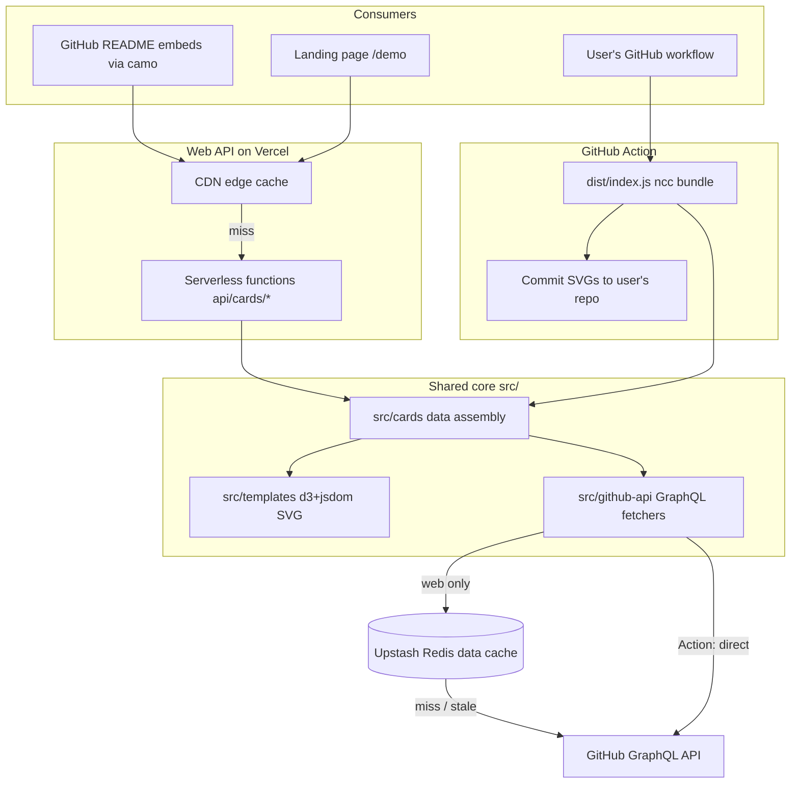

# Architecture

This project ships **two delivery modes from one codebase**:

| Mode | Entry | Data freshness | Whose API quota | Repo coverage |
|---|---|---|---|---|
| **Web API** (Vercel) | `api/cards/*.ts` | CDN + Redis cached | Shared service tokens | Up to 1,000 repos (10 pages) |
| **GitHub Action** | `dist/index.js` → `src/app.ts` | Regenerated per run | The user's own token | Unbounded |

Both modes share the same core: `src/github-api/` (GraphQL fetchers), `src/cards/` (data → chart data), and `src/templates/` (d3 + jsdom SVG rendering).

## Documents

- [web-api.md](web-api.md) — Vercel request flow, token rotation, error handling
- [github-action.md](github-action.md) — Action run flow and inputs
- [caching.md](caching.md) — the two cache layers and quota strategy
- [release-pipeline.md](release-pipeline.md) — branch model, CI, release and deploy
