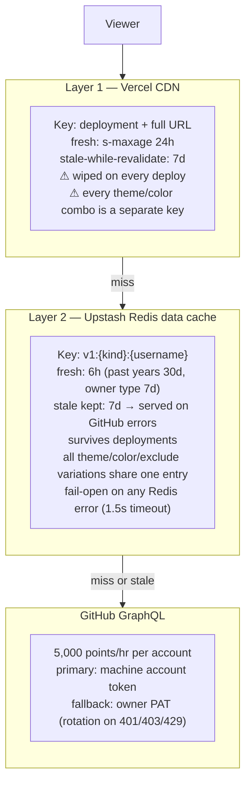

# Caching & quota strategy

Two layers sit between viewers and the GitHub API. They exist because the
hosted service runs on shared tokens: GitHub GraphQL allows **5,000 points per
hour per account** (all tokens of one account share the pool — which is why the
two service tokens belong to different accounts).

## What each layer protects against

| Scenario | Before | Now |
|---|---|---|
| Same user, different theme/colors | Each combo hit GitHub | One Redis entry serves all combos |
| New deployment | CDN cold → quota stampede | Redis is deployment-independent |
| GitHub rate limited | Error card (cached 300s) | Stale data renders a normal card |
| Redis outage / quota exhausted | — | Fail-open: behaves exactly like the pre-cache system |

## Error-card caching

Error cards are cached for **300s** (`public, max-age=300, s-maxage=300`) — long
enough that repeat views don't burn quota during an incident, short enough to
recover promptly. Successful cards use
`public, max-age=14400, s-maxage=86400, stale-while-revalidate=604800`
(`src/const/cache.ts`).
