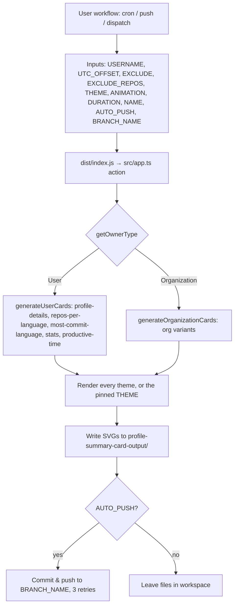

# GitHub Action

Consumed as `vn7n24fzkq/github-profile-summary-cards@<tag>`. The tag points at
the `release` branch state, which carries the ncc-bundled `dist/index.js`
(built by the release workflow — `dist/` does not live on `main`). Runs on the
`node24` Actions runtime.

## Run flow

## Differences from the Web API

| | GitHub Action | Web API |
|---|---|---|
| Token | User's own `GITHUB_TOKEN` secret | Shared service tokens |
| Repo pagination | Unbounded (every repo) | Bounded at 10 pages / 1,000 repos |
| Commit counts | All contribution years | All contribution years (per-year cached; past years are immutable so cache ~90d) |
| Redis cache | Not configured → `withDataCache` fails open, always fetches | 6h fresh / 7d stale; per-instance circuit breaker skips a dead Redis; **never changes data semantics** — it only buffers GitHub quota |
| Output | SVG files committed to the user's repo | SVG over HTTP |

The Action needs `permissions: contents: write` to push the generated cards.
