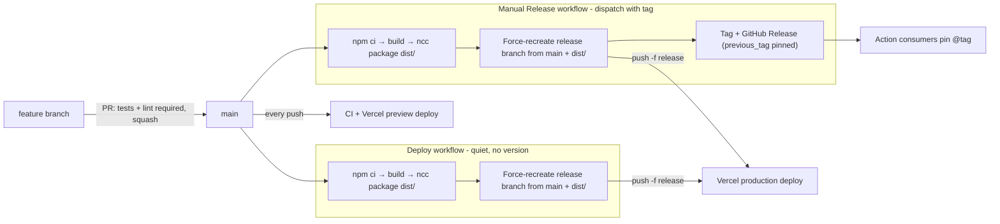

# Release pipeline

Deploys and releases are **separate events**: `deploy.yml` quietly ships main
to production (hotfixes, iterations), while `manual-release.yml` does the same
deploy **plus** a tag and a curated GitHub Release (the Action consumers' and
watchers' notification channel). Both publish through a single machine-managed
`release` branch. See [`RELEASE.md`](../../RELEASE.md) for the runbook.

## Branch model & flow

## Guardrails & gotchas

-   **`main` ruleset**: PRs required, `tests` + `lint` must be green, no force
    push; repo admin can bypass for emergency hotfixes.
-   **Release notes pin `previous_tag` explicitly** — `release` is
    force-recreated every time, so GitHub's automatic previous-tag detection
    walks back to ancient tags and every changelog looks identical.
-   **After a `vercel rollback`, auto-promotion is paused**: run
    `vercel promote` on the new deployment after the next release.
-   **Every production deploy wipes the CDN cache** — the Redis data cache
    absorbs the cold start.
-   **Vercel's runtime cannot `require()` ESM-only packages** even on Node 24
    (caused the #275 outage) — verify dependency changes on a preview
    deployment; local tests passing is not enough.

## Environments

| Environment | Branch             | GitHub token                           | Notes                                           |
| ----------- | ------------------ | -------------------------------------- | ----------------------------------------------- |
| Production  | `release`          | Machine account (+ owner PAT fallback) | Domain: github-profile-summary-cards.vercel.app |
| Preview     | any push / PR      | Owner PAT                              | Per-deployment URLs, protected by Vercel auth   |
| Development | local `vercel dev` | Owner PAT                              | `.env.local` (never committed)                  |

Env-var changes only take effect on the **next deployment**.
