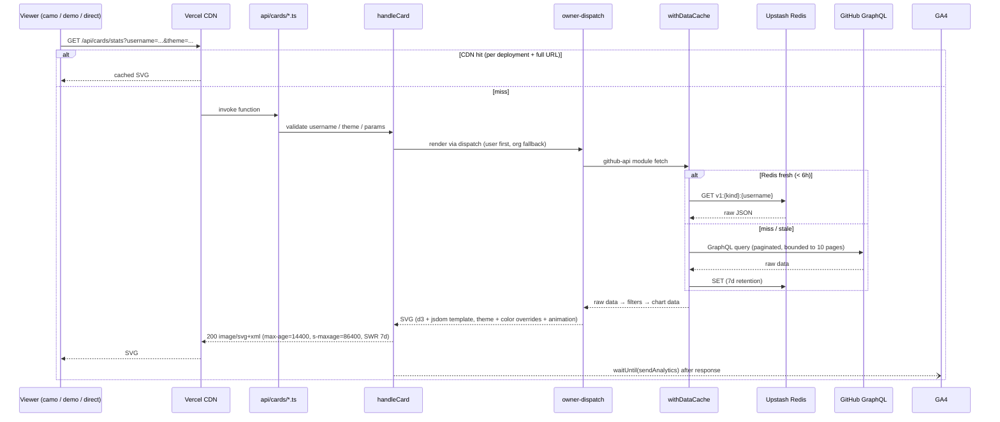
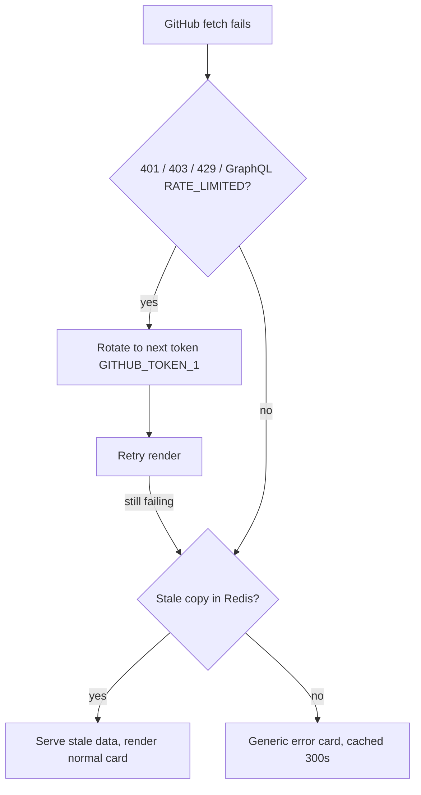

# Web API (Vercel)

Serverless functions under `api/cards/*.ts`, one per card. Production runs the
`release` branch on Node.js 24 (`memory: 128`, `maxDuration: 10` in
`vercel.json`).

## Request flow

## Failure handling

Key points:

- **Tokens**: `GITHUB_TOKEN` (machine account, production primary) →
  `GITHUB_TOKEN_1` (owner PAT, fallback). Same-account tokens share one
  quota pool, so the two tokens belong to different accounts.
- **Error messages are sanitised** (`safeErrorMessage`) — raw GitHub errors can
  leak the backing account and never reach the card.
- **Analytics never block or fail a card**: fired with `waitUntil` after the
  response; a bare fire-and-forget promise would be frozen with the lambda.
